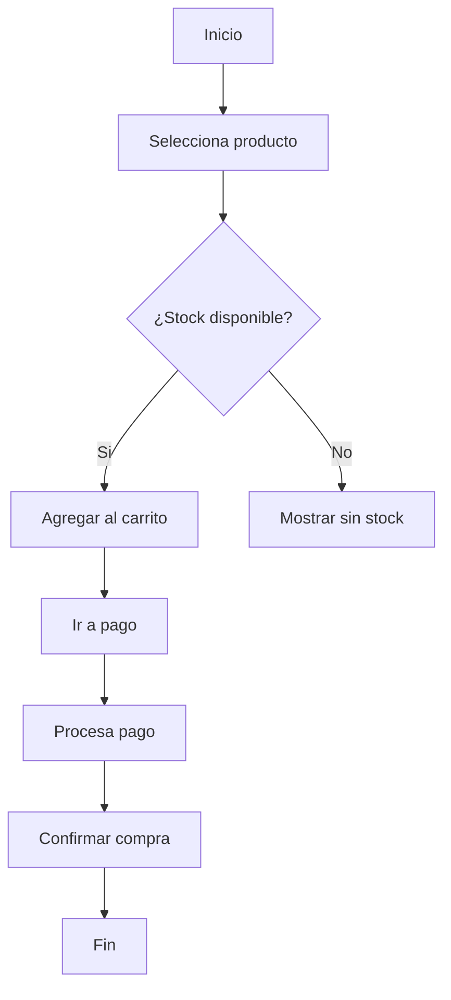

---

## Ejemplo rápido (Mermaid)

```mermaid
flowchart TB
  A[Inicio] --> B[Selecciona producto]
  B --> C{¿Stock disponible?}
  C -- Si --> D[Agregar al carrito]
  C -- No --> E[Mostrar sin stock]
  D --> F[Ir a pago]
  F --> G[Procesa pago]
  G --> H[Confirmar compra]
  H --> I[Fin]
```

Vincula este diagrama con el `Caso de Uso` correspondiente usando la plantilla en `templates.md`.
