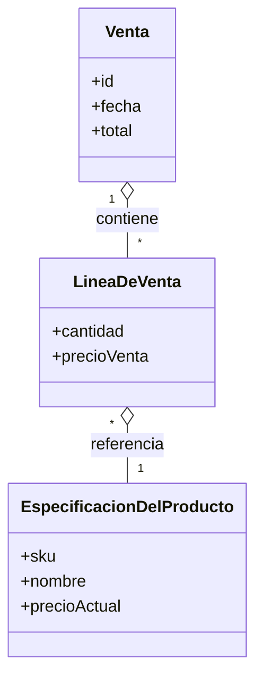

---

## Ejemplo rápido (Mermaid) — Modelo del Dominio (PDV)

```mermaid
classDiagram
  class Venta {
    +id
    +fecha
    +total
  }
  class LineaDeVenta {
    +cantidad
    +precioVenta
  }
  class EspecificacionDelProducto {
    +sku
    +nombre
    +precioActual
  }
  Venta "1" o-- "*" LineaDeVenta : contiene
  LineaDeVenta "*" o-- "1" EspecificacionDelProducto : referencia
```

Consejo: Use este diagrama como punto de partida; el modelo del dominio debe expandirse con asociaciones y atributos relevantes.
