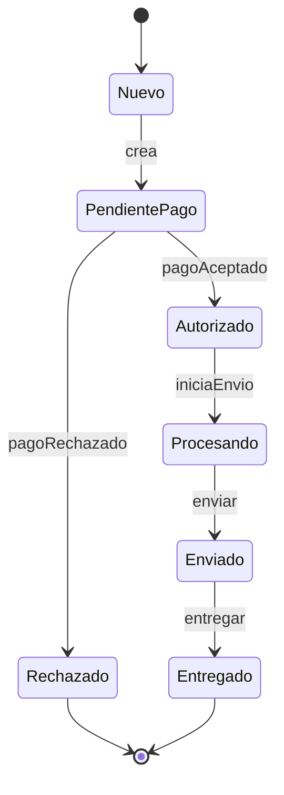

---

## Ejemplo rápido (Mermaid) — Diagrama de Estados (Pago)

```mermaid
stateDiagram-v2
  [*] --> Nuevo
  Nuevo --> PendientePago : crea
  PendientePago --> Autorizado : pagoAceptado
  PendientePago --> Rechazado : pagoRechazado
  Autorizado --> Procesando : iniciaEnvio
  Procesando --> Enviado : enviar
  Enviado --> Entregado : entregar
  Rechazado --> [*]
  Entregado --> [*]
```

Nota: Evitar modelar estados como subclases; los estados cambian con el tiempo, no son tipos.
