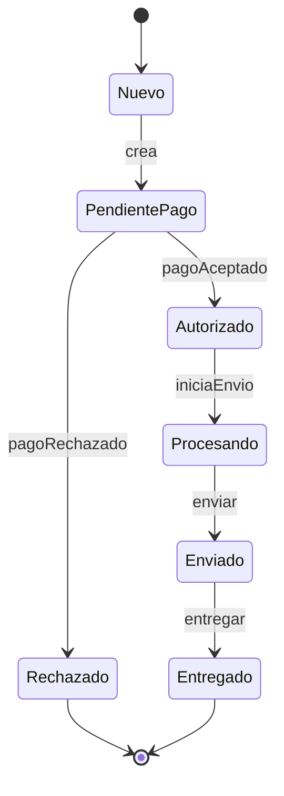

# Diagrama de Transición de Estados

Guía para crear diagramas que modelan los estados posibles de una entidad y las transiciones entre ellos.

## ¿Qué es el Diagrama de Transición de Estados (DTE)?

Es un diagrama UML que muestra:
- **Estados**: Condiciones en las que puede estar una entidad
- **Transiciones**: Cambios entre estados
- **Eventos**: Qué dispara cada cambio

**Diferencia importante**:
- **Diagrama de Actividad**: QUÉ hace el sistema
- **Diagrama de Transición de Estados**: EN QUÉ ESTADO está el dato

**Ejemplo de uso**:
- Estados de un pedido: Nuevo → Procesando → Enviado → Entregado
- Estados de un usuario: Registrándose → Activo → Bloqueado → Eliminado

---

## Componentes

### Estado

Representa una condición significativa de una entidad en la que permanece por algún tiempo.

**Notación**: Círculo o rectángulo redondeado

```
┌──────────────┐
│    Estado    │
└──────────────┘
```

**Ejemplos**:
- Nuevo (recién creado)
- Activo (operativo)
- Suspendido (en pausa)
- Completado (terminado)

### Estado Inicial

Punto de inicio del ciclo de vida.

**Notación**: Círculo pequeño sólido

```
● ─→ ┌──────────┐
     │ Primero  │
     │ Estado   │
     └──────────┘
```

### Estado Final

Condición terminal.

**Notación**: Círculo con punto adentro (bullseye)

```
┌──────────────┐
│ Estado       │
│ Terminal     │
└──────┬───────┘
       │
       ⊙
```

### Transición

Cambio de un estado a otro, disparado por un evento.

**Notación**: Flecha con etiqueta

```
┌──────────┐  evento / acción  ┌──────────┐
│ Estado 1 │──────────────────→│ Estado 2 │
└──────────┘                   └──────────┘
```

**Sintaxis**: `evento [condición] / acción`

---

## Partes de una Transición

### Evento
Algo que ocurre en el sistema y causa el cambio.

**Ejemplos**:
- `usuarioAutenticado`
- `pagoAceptado`
- `pasoTiempo` (timeout)
- `errorOcurrió`

### Condición (Opcional)
Una guarda (guard) que determina si la transición ocurre.

**Formato**: `[condición]`

**Ejemplo**: `[saldo >= 100]`

### Acción (Opcional)
Qué hace el sistema cuando ocurre la transición.

**Formato**: `/acción`

**Ejemplo**: `/acreditarFondos()`

---

## Ejemplos Básicos

### Estados de un Cliente

```
    ┌──────────────┐
    │    Nuevo     │
    └──────┬───────┘
           │ registroConfirmado
           ↓
    ┌──────────────┐
    │    Activo    │
    └──────┬───────┘
           │ bloqueoPorMora
           ↓
    ┌──────────────┐
    │   Bloqueado  │
    └──────┬───────┘
           │ pagoDuda
           ↓
    ┌──────────────┐
    │  Suspendido  │
    └──────┬───────┘
           │ eliminaciónPermanente
           ↓
           ⊙
```

### Estados de un Pedido

```
●   ┌──────────────┐
│   │    Nuevo     │
└──→└──────┬───────┘
           │ confirmacion
           ↓
    ┌──────────────┐
    │ Confirmado   │
    └──────┬───────┘
           │ envio
           ↓
    ┌──────────────┐
    │   Enviado    │
    └──────┬───────┘
           │ entrega
           ↓
    ┌──────────────┐
    │ Entregado    │ ◄────┐
    └──────┬───────┘      │
           │ devolucion   │
           ↓              │
    ┌──────────────┐      │
    │Devuelto      │──────┘
    └──────┬───────┘
           │
           ⊙
```

### Estados con Condiciones y Acciones

```
    ┌─────────────────┐
    │    Ingresando   │
    └────────┬────────┘
             │ envioFormulario / validar()
             ↓
    ┌─────────────────┐
    │   Procesando    │
    └────────┬────────┘
           / \
        ✓/   \✗
        /     \
       /       [datos inválidos] /
      /        └──────────────────→ [Vuelve a Ingresando]
     /
┌───┴─────────┐
│ Completado  │
└─────┬───────┘
      │
      ⊙
```

---

## Estados Compuestos (Anidados)

Cuando un estado contiene sub-estados.

**Notación**: Un estado que contiene otros estados

```
┌───────────────────────────────┐
│   Estado Compuesto: Activo    │
│  ┌─────────────────────────┐  │
│  │ ┌──────────┐            │  │
│  │ │          │ trabajando │  │
│  │ └──────────┘            │  │
│  │        ↕                │  │
│  │ ┌──────────┐            │  │
│  │ │ descanso │            │  │
│  │ └──────────┘            │  │
│  └─────────────────────────┘  │
│              │                │
└──────────────┼────────────────┘
               │ pausar
               ↓
          ┌─────────┐
          │ Pausado │
          └─────────┘
```

---

## Estados Concurrentes

Cuando una entidad puede estar en **múltiples estados simultáneamente** en diferentes aspectos.

**Notación**: Línea punteada separando regiones

```
┌────────────────────────────────┐
│      Estado Compuesto          │
├─────────────────┬──────────────┤
│ Aspecto 1       │  Aspecto 2   │
│                 │              │
│ ┌────────┐     │ ┌──────────┐ │
│ │ Nuevo  │     │ │ Sin pagar│ │
│ │        │────→│ │          │ │
│ └────────┘     │ └──────────┘ │
│                │       │      │
│              │ Pagado │      │
│                │ ←─────┘      │
└─────────────────┼──────────────┘
                  │
                  ↓
               Final
```

---

## Tabla de Transiciones de Estados

Alternativa tabular para documentar todos los cambios.

### Plantilla

| Estado Actual | Evento | Condición | Acción | Estado Nuevo |
|---|---|---|---|---|
| | | | | |

### Ejemplo: Estados de Pedido

| Estado Actual | Evento | Condición | Acción | Estado Nuevo |
|---|---|---|---|---|
| Nuevo | confirmacion | [cliente confirmó] | guardarPedido() | Confirmado |
| Confirmado | envio | [stock disponible] | crearOrdenCompra() | Enviado |
| Confirmado | cancelacion | [antes de 24h] | devolverPago() | Cancelado |
| Enviado | entrega | [recibido] | actualizarStock() | Entregado |
| Entregado | devolucion | [dentro de 30 días] | crear RMA() | Devuelto |
| Cancelado | - | - | - | Final |
| Devuelto | - | - | - | Final |

---

## Errores Comunes

❌ **Incorrecto**:
- Transiciones sin evento (¿cuándo ocurren?)
- Estados que no son claramente diferentes
- No usar estado inicial/final
- Transiciones ambiguas o contradictorias

✅ **Correcto**:
- Todo cambio tiene un evento claro
- Estados representan condiciones distintas
- Hay estado inicial y final definidos
- Transiciones son precisas y verificables

---

## Checklist para tu Diagrama de Transición de Estados

- [ ] Se identificaron TODOS los estados posibles
- [ ] Existe estado inicial (●)
- [ ] Existe estado final (⊙)
- [ ] Cada transición tiene un evento
- [ ] Las condiciones están etiquetadas [entre corchetes]
- [ ] Las acciones están etiquetadas /así
- [ ] No hay transiciones imposibles
- [ ] Los estados son distintos y significativos
- [ ] Se validó con especialista del dominio
- [ ] Corresponde a un diagrama de actividad o caso de uso específico
---

## Ejemplo rápido (Mermaid) — Diagrama de Estados (Pago)



Nota: Evitar modelar estados como subclases; los estados cambian con el tiempo, no son tipos.
