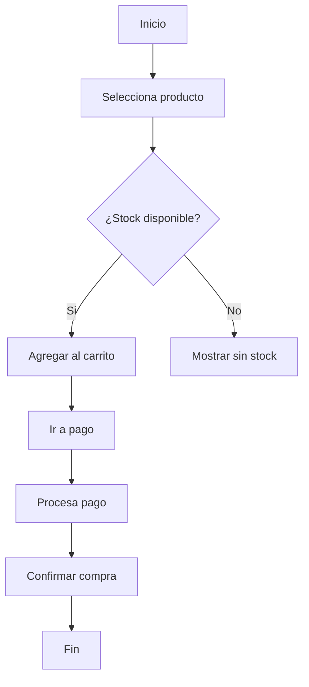

# Diagramas de Actividad

Guía para crear diagramas UML de actividad que modelan el flujo de control y datos de procesos.

## ¿Qué es un Diagrama de Actividad?

Un diagrama de actividad es un **diagrama de flujo UML que modela el flujo de control** entre actividades. Muestra:
- **Qué actividades** se ejecutan
- **En qué orden** se ejecutan
- **Qué decisiones** se toman
- **Cómo se comunican** con datos

**Diferencia importante**:
- **Diagrama de Actividad**: QUÉ hace un proceso
- **Diagrama de Secuencia**: QUIÉN (actor) interactúa y en QUÉ orden

---

## Componentes Básicos

### Actividad (Nodo)

Representa una tarea o acción que se realiza.

**Notación**: Rectángulo redondeado
```
┌─────────────────┐
│ Registrar venta │
└─────────────────┘
```

**Ejemplos**:
- Abrir el formulario
- Validar datos
- Guardar en base de datos

---

### Flujo de Control

Indica el flujo entre actividades.

**Notación**: Flecha sólida
```
┌─────────────┐
│  Actividad1 │ ─→ ┌─────────────┐
└─────────────┘    │ Actividad 2 │
                   └─────────────┘
```

---

### Decisión (Bifurcación)

Divide el flujo en 2 o más caminos posibles basándose en una condición.

**Notación**: Rombo
```
      ┌─────────────┐
      │  Actividad  │
      └──────┬──────┘
             │
            ◇ ¿Válido?
           / \
         /     \
      Sí/       \No
      /           \
┌──────────┐    ┌────────────┐
│ Continuar│   │ Mostrar err│
└──────────┘    └────────────┘
```

**Importante**: Cada rama saliente debe estar **etiquetada** con la condición o la respuesta a la decisión.

---

### Unión (Sincronización)

Cuando múltiples flujos convergen en uno.

**Notación**: Línea gruesa horizontal
```
    ┌──────────┐
    │ Activ. A │
    └────┬─────┘
         │
    ┌────┴─────┐
    │  Activ. B │
    └────┬─────┘
         │
    ═════════════  ← Unión
         │
    ┌────┴─────────────┐
    │ Actividad común  │
    └──────────────────┘
```

---

### Bifurcación Concurrente (Paralelismo)

Indica que múltiples actividades pueden ocurrir **en paralelo**.

**Notación**: Línea gruesa horizontal
```
    ┌──────────────────┐
    │   Actividad 1    │
    └────┬─────────────┘
         │
    ═════════════  ← Bifurcación
         │
    ┌────┴─────┐
    │           │
    │           │
┌───┴────┐  ┌───┴────┐
│Act. 2a │  │Act. 2b │  ← Ocurren en paralelo
└───┬────┘  └───┬────┘
    │           │
    └─────┬─────┘
        ═════════════  ← Unión (espera ambas)
          │
    ┌─────┴──────────┐
    │  Actividad 3   │
    └────────────────┘
```

---

### Nodo Inicial

Punto de inicio del flujo.

**Notación**: Círculo sólido pequeño
```
● → ┌─────────────┐
    │  Primera    │
    │ Actividad   │
    └─────────────┘
```

---

### Nodo Final

Punto donde termina el flujo.

**Notación**: Círculo con punto adentro (bullseye)
```
    ┌─────────────┐
    │  Actividad  │
    │  Final      │
    └─────┬───────┘
          │
          ⊙  ← Nodo final
```

---

### Carriles / Swimlanes (Opcional)

Dividen el diagrama para mostrar **qué actor o sistema** es responsable de cada actividad.

**Notación**: Columnas o filas

```
        Cliente        │        Sistema
───────────────────────┼──────────────────
●                      │
│                      │
└─→ ┌──────────────┐  │
    │ Inicia       │  │
    │ compra       │  │
    └──────┬───────┘  │
           │          │
           └─────────→│┌─────────────┐
                      ││ Valida      │
                      ││ datos       │
                      │└──────┬──────┘
                      │       │
                      └───────→│┌─────────┐
                           │││ Procesa  │
                           │││ pago     │
                           │└─┬────────┘
                           │  │
                      ┌────┴──┴───────┐
                      │ Confirma      │
                      │ compra        │
                      └────┬──────────┘
                           ⊙
```

---

## Ejemplo: Proceso de Compra Completo

```
        Cliente        │     Sistema       │    Pasarela
────────────────────────┼───────────────────┼────────────
●                       │                   │
│                       │                   │
└─→ ┌─────────────┐    │                   │
    │ Selecciona  │    │                   │
    │ producto    │    │                   │
    └──────┬──────┘    │                   │
           │           │                   │
           └──────────→│ ┌──────────────┐  │
                       │ │ Valida       │  │
                       │ │ producto     │  │
                       │ └──────┬───────┘  │
                       │        │          │
                       │        ├─────────→│┌──────────┐
                       │        │          ││ Procesa  │
                       │        │          ││ pago     │
                       │        │          │└────┬─────┘
                       │        │          │     │
           ◇ ¿Aprobado?│        │←────────┤┴─────┤
          / \          │        │         │
        Sí  No         │        │         │
       /     \         │        │         │
      /       └───────→│┌──────────┐     │
     │                 ││ Rechaza  │     │
     │                 ││ pago     │     │
     │                 │└──────────┘     │
     │                 │                 │
     └────────────────→│┌──────────────┐ │
                       ││ Genera orden │ │
                       ││ de venta     │ │
                       │└──────┬───────┘ │
                       │       │         │
    ┌──────────────────┴┬──────┴─────────┘
    │                  │
┌───┴──────────┐   ┌────┴────────┐
│ Recibe orden │   │ Confirma    │
│ confirmac.   │   │ compra      │
└───┬──────────┘   └────┬────────┘
    │                   │
    └───────┬───────────┘
            │
            ⊙
```

---

## Errores Comunes

❌ **Incorrecto**:
- Usar rectángulos normales en lugar de redondeados para actividades
- No etiquetar las ramas de decisión
- Mezclar flujos sin usar uniones claramente
- Usar carriles innecesariamente (solo si realmente quieres mostrar responsabilidades)

✅ **Correcto**:
- Actividades con forma clara
- Condiciones explícitas en decisiones
- Flujos claros y sin ambigüedades
- Usar bifurcación/unión para paralelismo real

---

## Plantilla Básica

```
        Actor 1        │    Sistema      │   Actor 2
───────────────────────┼─────────────────┼──────────
●                      │                 │
│                      │                 │
└─→ [Actividad inicio] │                 │
                       │                 │
    ┌────────────┐     │                 │
    │ Paso 1     │────→│┌──────────────┐ │
    └────────────┘     ││ Procesa      │ │
                       │└──────┬───────┘ │
                       │       │         │
                      ◇        │         │
                     / \       │         │
                   /     \     │         │
                 Sí        No  │         │
               /             \│         │
         ┌──────────┐    ┌────────────┐
         │ Acción A │    │ Acción B   │
         └────┬─────┘    └────┬───────┘
              │               │
              └───────┬───────┘
                      │
                   ═══════  ← Unión
                      │
                   ⊙ FIN
```

---

## Checklist para Diagramas de Actividad

- [ ] Tiene nodo inicial y final
- [ ] Las actividades están claramente nombradas
- [ ] Las decisiones tienen condiciones etiquetadas
- [ ] Se usa bifurcación/unión para flujos paralelos
- [ ] El flujo es legible de arriba hacia abajo
- [ ] Si usa swimlanes, está claro quién hace cada actividad
- [ ] Los rombos tienen exactamente 2 o más salidas etiquetadas
- [ ] Se valida el diagrama con stakeholders

---

## Ejemplo rápido (Mermaid)


Vincula este diagrama con el Caso de Uso correspondiente usando la plantilla en 	emplates.md.
---

## Ejemplo rápido (Mermaid)



Vincula este diagrama con el `Caso de Uso` correspondiente usando la plantilla en `templates.md`.
