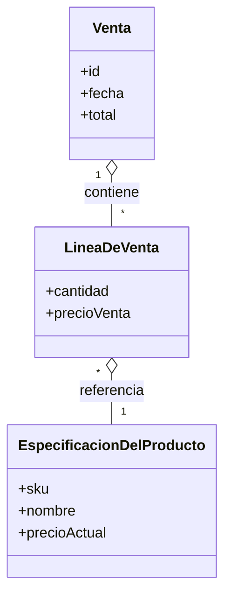

# Modelo del Dominio

Guía para crear un modelo conceptual que representa las entidades y relaciones del negocio.

## ¿Qué es un Modelo del Dominio?

Un modelo del dominio es un **diagrama que captura el vocabulario y conceptos del negocio**. Muestra:
- **Entidades** (cosas que existen)
- **Atributos** (características de las entidades)
- **Relaciones** (cómo se conectan)

**No es un modelo técnico**: no especifica cómo se implementa en base de datos. Es una representación del mundo real del negocio.

---

## Conceptos Clave

### Entidad (Clase de Dominio)

Representa algo que existe en el negocio: conceptos, cosas, personas.

**Notación UML**: Rectángulo con compartimientos

```
┌────────────────┐
│    Cliente     │
├────────────────┤
│ - dni: string  │
│ - nombre: str  │
│ - email: str   │
├────────────────┤
│ + registrarse()│
└────────────────┘
```

**Elementos**:
- **Nombre**: Singular, PascalCase (Cliente, Producto, Pedido)
- **Atributos**: Propiedades (- dni, - nombre)
- **Métodos**: Operaciones (+ registrarse)

---

## Mejoras añadidas desde el resumen

- Técnicas prácticas: **Lista de categorías de clases conceptuales** y **identificación de frases nominales** como fuentes para descubrir clases.
- Guía para decidir **atributo vs clase**: cuando un dato tiene estructura, operaciones o múltiples valores, modelarlo como clase (ej: `ArticuloID`, `Cantidad`, `Direccion`).
- Reglas importantes: **Regla del 100%** y **Regla Es-un** para validar jerarquías de generalización.
- Asociación: criterio **"necesito-conocer"** para decidir si mostrar una asociación en el modelo del dominio.

## Técnicas para identificar clases conceptuales

1. Lista de categorías: revisar categorías comunes (objetos tangibles, transacciones, roles, contenedores, catálogos, reglas, informes, servicios, conceptos abstractos) y anotar candidatos.
2. Identificación de frases nominales: extraer sustantivos y frases nominales de los casos de uso y requisitos; validarlas y consolidarlas (unificar sinónimos).
3. Patrones y plantillas: usar patrones de dominio conocidos (por ejemplo: `Pago` y sus subtipos) como punto de partida.

Consejo: prefiera incluir más clases conceptuales en el análisis que omitirlas; los atributos pueden refinarse después durante el diseño.

## Atributos vs Clases (tipos no primitivos)

- Modele como **atributo** cuando el dato es simple (número, texto, fecha, booleano).
- Modele como **clase** cuando:
     - Tiene partes internas (por ejemplo `Direccion` con calle/ciudad/CP).
     - Requiere operaciones o validación propia (`NumeroDeTelefono`).
     - Tiene múltiples instancias con identidad no trivial o historial (precios históricos).

Ejemplo práctico: para el PDV, `EspecificacionDelProducto` es una clase; `ArticuloID` puede ser una clase no primitiva si requiere formato/validación.

## Asociaciones: criterio "necesito-conocer"

Muestre una asociación en el modelo del dominio cuando se necesite conservar el conocimiento de la relación durante algún tiempo (ej: `Venta` — `LineaDeVenta`). Evite asociaciones redundantes.

Guía rápida:
- Pregunte: ¿Necesitamos registrar esta relación? → si sí, es candidata a asociación.
- Si la relación vuelve a aparecer con datos asociados, considere una **clase asociación** (ej: `ContratoDeServicio` entre `Tienda` y `ServicioAutorizacion`).

## Reglas para generalización

- **Regla del 100%**: todas las propiedades (atributos y asociaciones) de la superclase deben aplicar a la subclase.
- **Regla Es-un**: cada instancia de la subclase debe ser también instancia de la superclase (se puede probar con la frase "X es un Y").

Agregar ejemplos y diagramas de muestra ayuda a validar decisiones; considera usar Mermaid para gráficos rápidos.

### Atributos

Son características o propiedades de una entidad.

**Notación**: `visibilidad nombre: tipo`

- **Visibilidad**: 
  - `-` privado
  - `+` público
  - `#` protegido

**Ejemplos**:
```
- dni: string
- edad: integer
- activo: boolean
- fechaRegistro: date
```

### Relaciones

Representan cómo se conectan las entidades.

#### Asociación Simple

Indica que dos entidades están conectadas.

**Notación**: Línea sólida

```
┌───────────┐        ┌────────┐
│ Cliente   │────────│ Pedido │
└───────────┘        └────────┘
```

Lectura: "Cliente está asociado con Pedido"

#### Agregación (Has-A)

Relación donde una entidad **contiene** a otra, pero ambas **pueden existir independientemente**.

**Notación**: Línea con rombo vacío (lado del contenedor)

```
┌───────────┐◇────────┌──────────┐
│  Carro    │         │ Rueda    │
└───────────┘         └──────────┘
```

Lectura: "Carro tiene Ruedas, pero Ruedas pueden existir sin Carro"

#### Composición (Part-Of)

Relación donde una entidad **es parte de** otra y **no puede existir sin ella**.

**Notación**: Línea con rombo sólido (lado del contenedor)

```
┌───────────┐●────────┌──────────┐
│  Libro    │         │ Página   │
└───────────┘         └──────────┘
```

Lectura: "Libro está compuesto por Páginas. Página no puede existir sin Libro"

#### Herencia (Is-A)

Relación donde una entidad **es un tipo de** otra.

**Notación**: Flecha con triángulo vacío (apunta a la clase padre)

```
        ┌──────────┐
        │ Persona  │
        └────┬─────┘
             △
             │
       ┌─────┴─────┐
       │           │
    ┌──────┐    ┌────────┐
    │Cliente    │Empleado│
    └──────┘    └────────┘
```

Lectura: "Cliente es un tipo de Persona. Empleado es un tipo de Persona"

---

## Multiplicidades (Cardinalidad)

Indican **cuántas instancias** de una entidad se relacionan con otra.

**Notación**: Colocar números en los extremos de la relación

| Símbolo | Significado |
|---------|------------|
| 1 | Exactamente uno |
| 0..1 | Cero o uno (opcional) |
| n o \* | Cero o más (muchos) |
| 1..n | Uno o más |
| m..n | Entre m y n |

**Ejemplos**:

```
Cliente ────1─────→ Cédula     (Un cliente tiene una sola cédula)

Cliente ────1─────→ Dirección  (Un cliente tiene una sola dirección principal)
         ────0..1──

Pedido ────1─────→ LineaPedido (Un pedido tiene muchas líneas)
        ────*──

Departamento ─────1────→ Empleado (Un depto tiene muchos empleados)
             ─────*──

         ┌──────────┐
         │ Cliente  │
         │1        *│
         └────┬─────┘
              │
         tiene
              │
         ┌────┴────────┐
         │ Pedido       │
         └──────────────┘
```

Lectura: "Un Cliente tiene MUCHOS Pedidos. Un Pedido pertenece a UN Cliente"

---

## Plantilla de Entidad Completa

```
┌─────────────────────────────┐
│        Entidad              │
├─────────────────────────────┤
│ Atributos:                  │
│ - id: int                   │
│ - nombre: string            │
│ - descripcion: string       │
│ - fechaCreacion: date       │
│ - estado: {Activo, Inactivo}│
├─────────────────────────────┤
│ Métodos:                    │
│ + crear()                   │
│ + modificar()               │
│ + eliminar()                │
│ + obtenerDetalles()         │
└─────────────────────────────┘
```

---

## Ejemplo Completo: Modelo de Tienda

```
┌──────────────┐        ┌───────────┐        ┌──────────────┐
│   Cliente    │1───────*│  Pedido   │1───────*│ LineaPedido  │
│──────────────│        │───────────│        │──────────────│
│- dni         │        │- nroPedido│        │- cantidad    │
│- nombre      │        │- fecha    │        │- precioUnit  │
│- email       │        │- estado   │        │- subtotal    │
└──────────────┘        └─────┬─────┘        └────────┬─────┘
                              │                       │1
                              │                    ┌──┴────────┐
                              │                    │ Producto  │
                              │                    │───────────│
                              │                    │- codProd  │
                              │                    │- nombre   │
                              │                    │- precio   │
                              │                    │- stock    │
                              │                    └───────────┘
                              │
         ┌────────────────────┘
         │1
    ┌────┴─────────┐
    │ Factura      │
    │──────────────│
    │- nroFactura  │
    │- fecha       │
    │- total       │
    └──────────────┘
```

---

## Tipos de Métodos en el Modelo

**Métodos CRUD**:
- `+ crear()` - Crear una nueva instancia
- `+ obtener()` - Recuperar instancia
- `+ modificar()` - Cambiar datos
- `+ eliminar()` - Borrar instancia

**Métodos de Cálculo**:
- `+ calcularTotal()` - Operación que computa algo
- `+ obtenerEstado()` - Derivar información

---

## Diferencia: Modelo del Dominio vs Modelo de Datos

| Aspecto | Modelo del Dominio | Modelo de Datos |
|---------|-------------------|-----------------|
| **Propósito** | Entender el negocio | Diseñar base de datos |
| **Nivel** | Conceptual | Técnico |
| **Autor** | Analista + Stakeholders | Diseñador de BD |
| **Detalles** | Solo conceptos clave | Incluye tipos exactos, constraints |
| **Relaciones** | Semántica (tiene, es-un, contiene) | Claves foráneas |

---

## Checklist para tu Modelo del Dominio

- [ ] Identifica las entidades principales del negocio
- [ ] Cada entidad tiene atributos significativos
- [ ] Las relaciones están claramente etiquetadas
- [ ] Multiplicidades son correctas
- [ ] Usa herencia cuando hace sentido (es-un)
- [ ] Distingue agregación vs composición
- [ ] Los nombres son singulares y descriptivos
- [ ] Se validó con los stakeholders
- [ ] Es independiente de la implementación técnica
---

## Ejemplo rápido (Mermaid) — Modelo del Dominio (PDV)



Consejo: Use este diagrama como punto de partida; el modelo del dominio debe expandirse con asociaciones y atributos relevantes.
